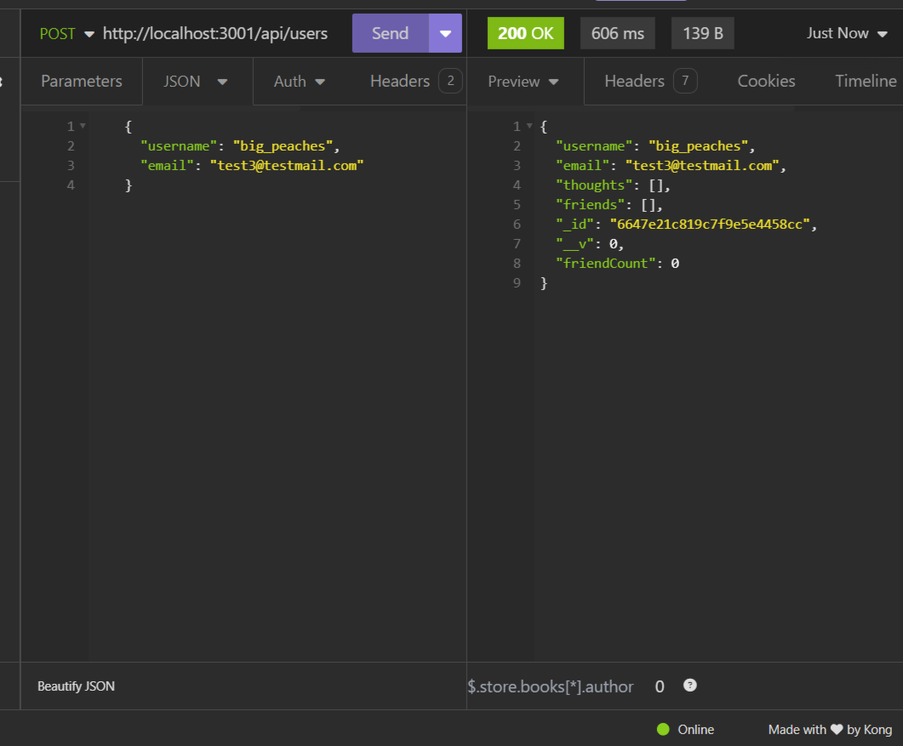
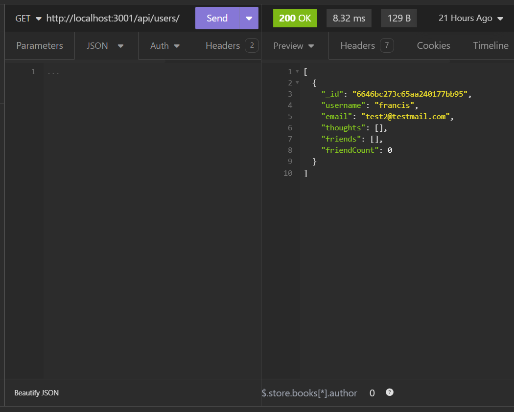

# Mongo DB Social Network Backend

## Description

The challenge with this project was to create a functional backend for a social network site that would allow users to create an account, post, and react to other users' posts. To accomplish this I used MongoDB to establish relationships between documents, as well as Expressjs and nodejs to create the routes.

## Table of Contents

- [Installation](#installation)
- [Usage](#usage)
- [Credits](#credits)
- [License](#license)

## Installation

To run this project you will need to have:
- Git Bash (Windows)/Terminal (Mac)
- Node.js
- MongoDB
- Insomnia

Clone the repository to your local device and navigate to the directory that contains the repository using Git Bash/Terminal. 

Run `npm i` to install the required dependencies. Then run `npm start` to start the connection to the MongoDB server. Navigate to Insomnia and go to http://localhost:3001 to interact with the application

## Usage

You can see a video of me interacting with the API using Insomnia [here]()

## Known Issues

- Currently no routes to add reactions to thoughts
- GET All Users/Single User requests do not populate thoughts or friends

## Credits

I received a lot of help on this project and shared code with my classmates in the SMU Full Stack Web Development bootcamp

## License

This project is licensed with the MIT license 2024 by Jessica Jones
---